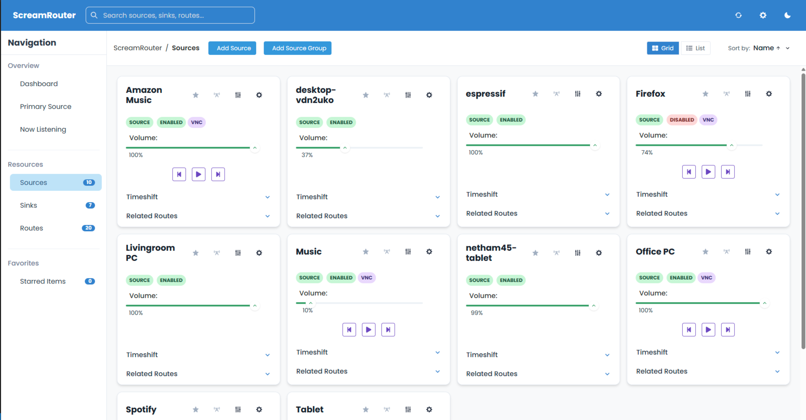
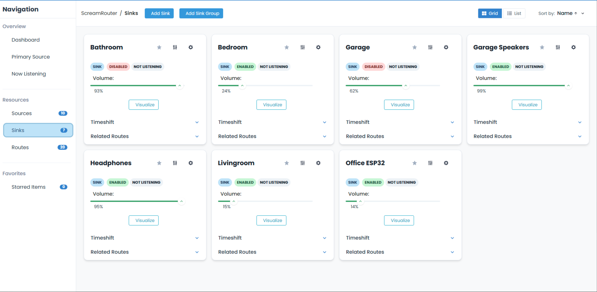
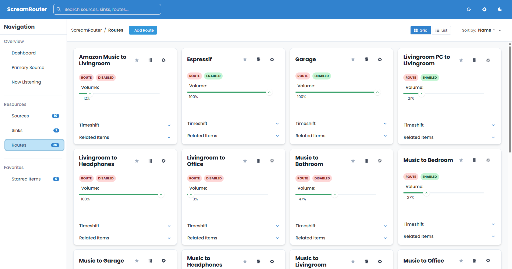
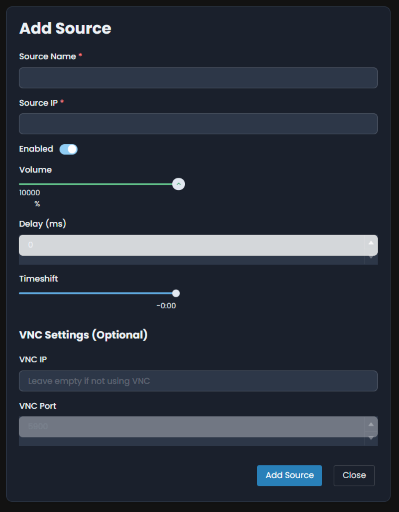
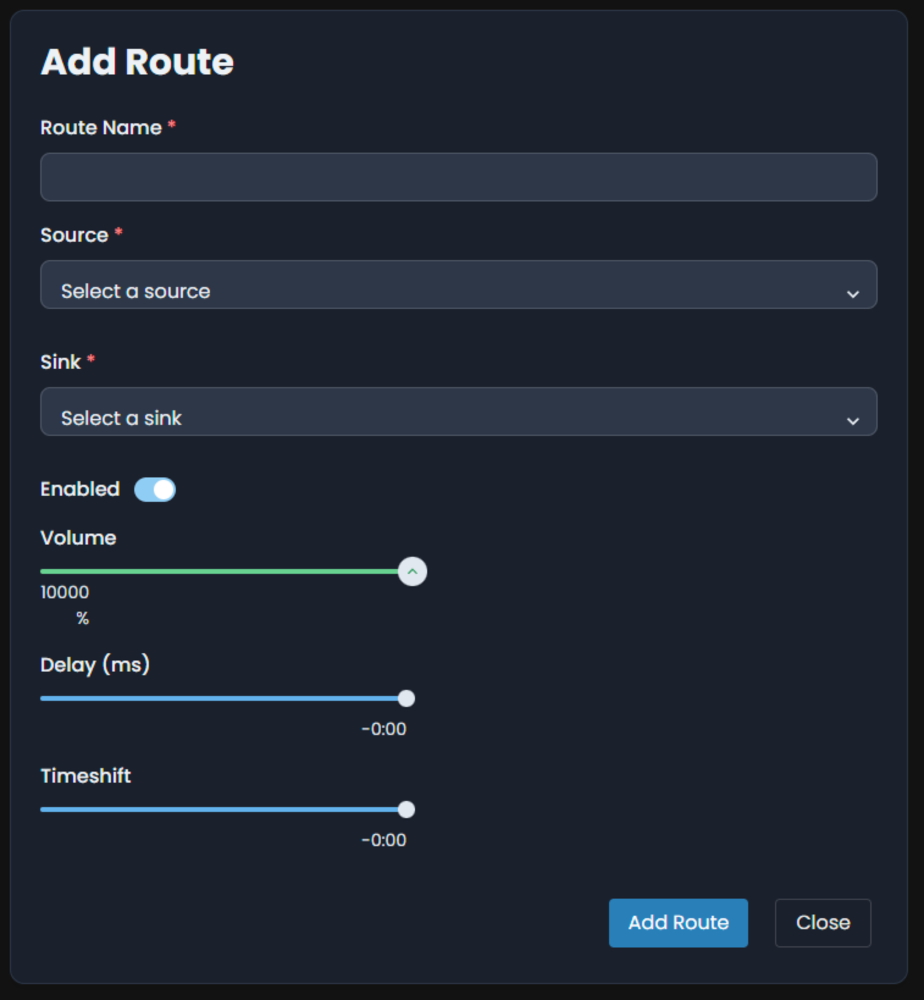
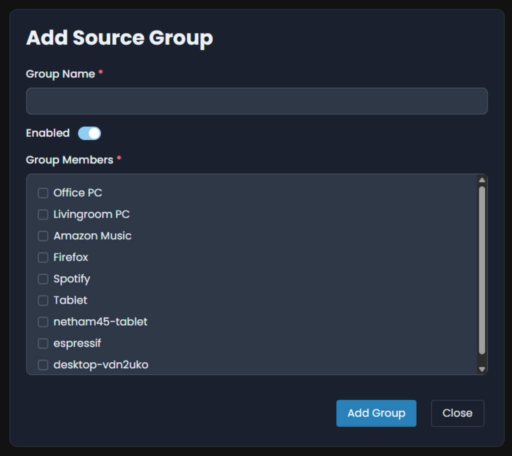
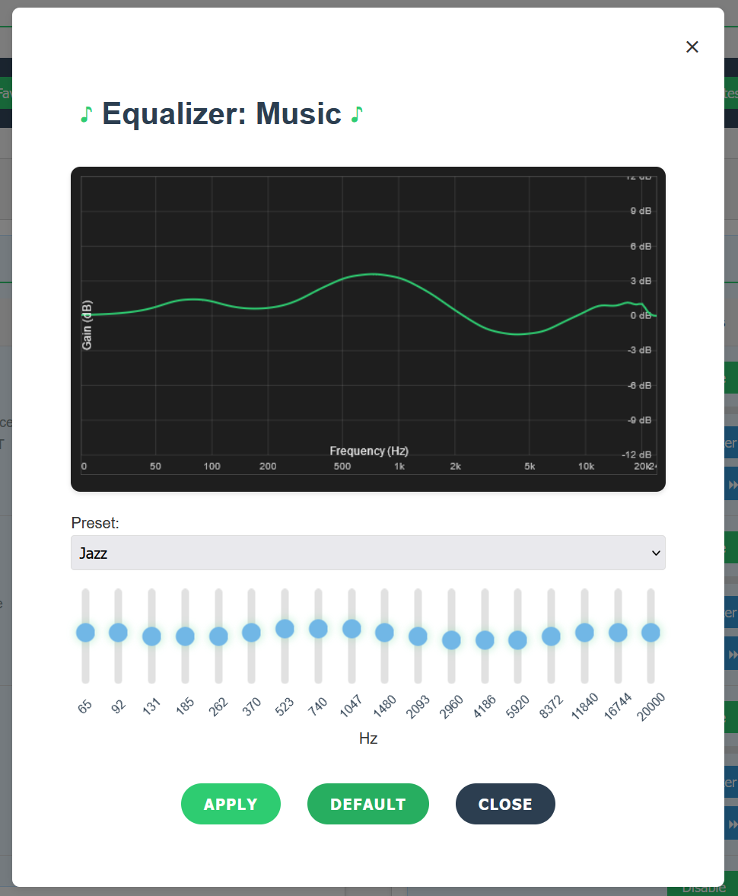

ScreamRouter
============

<p>
  <a href="https://img.shields.io/badge/License-AGPL--3.0-blue.svg"></a>
  <a href="https://img.shields.io/badge/Python-3.10%2B-3776AB"></a>
  <a href="https://img.shields.io/badge/FastAPI-async-green"></a>
  <a href="https://img.shields.io/badge/WebRTC-WHEP-FF6F00"></a>
  <a href="https://img.shields.io/badge/C%2B%2B-pybind11-00599C"></a>
  <a href="https://img.shields.io/badge/Docker-ready-2496ED"></a>
</p>
The real‑time router for your whole‑home, studio, and lab audio.

ScreamRouter brings together a pro‑grade C++ audio engine and a friendly web UI so you can route, mix, and monitor audio across your network with confidence. Bridge Scream, RTP, and local capture, apply EQ and delay per stream, and listen from any browser with low‑latency WebRTC.

Overview
--------

- One router for heterogeneous audio: Scream, RTP, PulseAudio (native protocol), local capture, and browsers — all in one place.
- Per‑stream control: volume, delay, time‑shift, EQ, speaker mapping — at source, route, or sink level.
- Designed for real‑time: jitter‑aware buffering, resync controls, and WHEP WebRTC for low‑latency monitoring.
- Ready for busy homes and labs: discovery, grouping, multi‑device RTP, live logs, stats, and hot reconfig.
- Extensible: plugins for new sources, ALSA PCM plugin for native apps, and noVNC to drive hosts.

What You Can Do
---------------

- Drive multi‑room audio while keeping rooms in sync.
- Downmix 5.1 → stereo for phones or upmix stereo → multi-speaker layouts.
- Monitor any route from your browser with low latency (WHEP).
- Inject URLs (streams, files) directly into a sink or group.
- Route per-process audio from a desktop to any room.
- Inspect, tune, and recover issues quickly with live logs and stats.
- Scrub and export the last five minutes of PCM from any source with the browser-based timeshift editor.

Get Started in 2 Minutes
------------------------

Linux (host networking, best for multicast):
```bash
docker run -d --network host \
  -v $PWD/config:/app/config \
  -v $PWD/logs:/app/logs \
  -v $PWD/cert:/app/cert \
  --name screamrouter \
  netham45/screamrouter:latest
# Open https://<host>/site (self‑signed TLS on first run)
```

Portable (port mapping; multicast discovery limited):
```bash
docker run -d \
  -p 443:443 -p 16401:16401/udp -p 40000:40000/udp \
  -v $PWD/config:/app/config -v $PWD/logs:/app/logs -v $PWD/cert:/app/cert \
  --name screamrouter \
  netham45/screamrouter:latest
```

> Note: Expose the UI only on trusted networks. For Internet access, place ScreamRouter behind a reverse proxy (TLS + auth) and restrict UDP ingress to the ports you actually use.

Who Is It For?
--------------

- Home integrators: whole‑home audio with room groups, EQ per zone, and browser monitors.
- Streamers/podcasters: low‑latency monitoring and quick route swaps.
- AV/lab engineers: matrix tests, multi‑device RTP mapping, rapid troubleshooting.
- Developers: clean APIs, plugin hooks, and a React SPA for rich control.

Images and diagrams: images/ScreamRouter.png


Learn More
----------

- Why ScreamRouter? See below.
- Screenshots: a quick tour of the UI.
- Deep dive: full architecture, APIs, settings, and configuration details.


Table of Contents
-----------------

- Product Overview
- Get Started in 2 Minutes
- Who Is It For?
- Screenshots
- Why ScreamRouter?
- Architecture Overview
- At‑a‑Glance Capabilities
- Feature Highlights
- Deep Dive
  - Backend Runtime
  - Configuration Management
  - APIs (Backend)
  - Streaming & WebSockets
  - WebRTC Lifecycle
  - VNC Proxy & Website
  - Plugin System
  - Utilities
  - Logging
  - Frontend (React)
  - ALSA PCM Plugin
  - Running & Build Details
  - Quick Starts by Persona
  - Configuration Files & Examples
  - Tuning Guide
  - Security & Deployment Hardening
  - API Usage Examples
  - License


Architecture Overview
---------------------

- Core: C++ audio engine (pybind11 module `screamrouter_audio_engine`) for low‑latency DSP, mixing, buffering, and transport.
- Control plane: Python FastAPI application for configuration, APIs, WebSockets, WebRTC signaling, logging, discovery, and serving the site.
- Frontend: React (Chakra UI) single‑page app, compiled into `site/` and served under `/site`.
- Discovery: mDNS discovery (Zeroconf) and PTR responder, optional NTP micro‑server for time features.
- Plugins: Python plugin system for new sources/actions (e.g., play URL via ffmpeg).
- Protocols: Scream (UDP), RTP, system audio endpoints, MP3 over HTTP/WebSocket, WebRTC (WHEP) for browser playback.

Why ScreamRouter?
-----------------

- One router for heterogeneous audio: bridge Scream, RTP, local capture, and browsers without vendor lock‑in.
- Per‑entity DSP, not all‑or‑nothing: independent volume, delay, EQ, timeshift, and speaker mapping at source/route/sink levels.
- Designed for real‑time: jitter‑aware timeshifts, resync controls, and WHEP for low‑latency browser monitoring.
- Operational visibility built‑in: live logs viewer, engine stats, structured settings, and configuration diffs over WebSocket.
- Extensible at the edges: plugin API for new sources or behaviors; ALSA PCM to plug native apps; noVNC to drive sources.


Comparison
----------

How ScreamRouter stacks up against common options (out‑of‑the‑box):

| Capability | ScreamRouter | Snapcast | AirPlay (RAOP) | PipeWire Remote |
|---|---|---|---|---|
| Multi‑protocol routing (Scream, RTP, system audio) | ✓ | ✗ (single server stream) | ✗ | △ (advanced setup) |
| Per‑entity volume / delay / EQ / time‑shift | ✓ (source/route/sink) | △ (per‑stream volume) | △ (volume) | △ (graph‑based) |
| Browser monitoring (WebRTC WHEP, sub‑second) | ✓ | ✗ | ✗ | ✗ |
| MP3 per‑sink web stream | ✓ | ✗ | ✗ | ✗ |
| Plugin framework (URL playback, extensible sources) | ✓ | ✗ | ✗ | ✗ |
| Live logs, stats, settings APIs | ✓ | △ (limited) | ✗ | △ (CLI tools) |
| Discovery + PTR + NTP helper | ✓ | △ (some zeroconf) | △ (Bonjour only) | ✗ |
| ALSA PCM plugin for native apps | ✓ | ✗ | ✗ | N/A (core audio graph) |
| Multi‑device RTP mapping | ✓ | ✗ | ✗ | △ (expert) |
| Temporary WebRTC sinks (no config churn) | ✓ | ✗ | ✗ | ✗ |
| Built‑in web UI & admin | ✓ | △ (community UIs) | ✗ | ✗ |

Notes:
- “△” indicates partial/indirect support or requires advanced, external tooling.
- AirPlay excels at consumer playback within Apple’s ecosystem but isn’t a general router. Snapcast delivers great multiroom sync for a single upstream. PipeWire is a superb local audio graph; cross‑network routing requires additional components.


At‑a‑Glance Capabilities
------------------------

- Ingest: Scream senders (Windows/Linux/ESP32), RTP senders, per‑process sources, local capture devices, and plugin‑driven streams.
- Distribute: network sinks (Scream/RTP), browser listeners (MP3/WebRTC), or local system audio endpoints.
- Process: per‑entity volume/delay/timeshift/EQ; global DSP tunables; speaker layout matrices for up/down‑mix.
- Coordinate: device discovery via mDNS; PTR hostname binding; optional NTP and time sync features for multi‑sink alignment.
- Operate: log aggregation and live streaming, preferences persistence, robust hot‑reload of configs, plugin lifecycle.
- Develop: full React SPA with live updates and hot module reload, WebRTC managers, stats/telemetry surfaces.


Architecture
------------

- `screamrouter/__main__.py` boots a FastAPI app, initializes the C++ `AudioManager`, wires subsystems, sets TLS, and runs uvicorn.
- `screamrouter/constants/constants.py` resolves directories/ports (root/non‑root/Windows aware), maps CLI args → env vars, and centralizes tunables.
- `screamrouter/configuration/` owns YAML config parsing, “solve and apply” orchestration to the C++ engine, background tasks, system audio inventory, and discovery.
- `screamrouter/api/` exposes HTTP and WebSocket APIs: configuration CRUD and live updates, streaming (MP3), WebRTC (WHEP), VNC proxy, logs viewer, system stats, and preferences.
- `screamrouter/plugin_manager/` hosts the plugin framework with built‑in plugins like Play URL (ffmpeg) and multi‑URL playback.
- `screamrouter/utils/` provides mDNS tools, PTR responder, tiny NTP server, and a minimal VNC client.
- `screamrouter-react/` is the React app (Chakra UI), built into `site/` and mounted at `/site`.
- `alsa_plugin/` contains an ALSA PCM plugin to expose ScreamRouter loopback taps via FIFOs.

High‑Level Architecture
```
┌──────────────────────────────────────────────────────────────────────┐
│                              ScreamRouter                             │
│                                                                      │
│  Sources                Control Plane (FastAPI)            Sinks     │
│  ───────                ─────────────────────────          ─────     │
│  • Scream senders  →    Config CRUD / WS diffs     →      • Scream   │
│  • RTP senders     →    WHEP (WebRTC) signaling   →      • RTP       │
│  • System capture  →    Logs / Stats / Settings   →      • System    │
│  • Plugins (ffmpeg)→    Site / VNC proxied UI     →      • Web (MP3) │
│                                                                      │
│                      C++ Audio Engine (pybind11)                      │
│         Mix / EQ / Timeshift / Sync / Encode / Transport             │
└──────────────────────────────────────────────────────────────────────┘
```


Feature Highlights
------------------

- Routing: define routes from sources to sinks, with per‑level enable/disable, volume, delay, timeshift, EQ, and speaker layouts.
- Sources: Scream (UDP), RTP, capture/process sources, plugin‑generated sources (e.g., ffmpeg), group sources, VNC metadata support.
- Sinks: network receivers (Scream, RTP), MP3 stream, system audio sinks, temporary WebRTC sinks for listening; grouping and multi‑device (RTP) mapping.
- Processing: low‑latency mixer, EQ (18‑band), normalization, soft‑clip, DC filter, oversampling, per‑stream timeshift buffers.
- Discovery: mDNS discovery (sources/sinks), manual PTR responder aligned to certificate SAN, and settings pinger/advertiser.
- Browser playback: MP3 HTTP/WebSocket stream per sink; WebRTC (WHEP) low‑latency path with ICE trickle and heartbeats.
- Logs: per‑module rolling logs, C++ log forwarding into Python loggers, live logs viewer via WebSocket.
- Preferences: persisted JSON preferences with schema validation and partial updates.
- Frontend: drag‑drop full menu, add/edit dialogs for sources/sinks/routes/groups, equalizer UI, visualizer, VNC, stats, discovery, and a listen page.
- ALSA: custom ALSA PCM plugin to bridge apps to FIFOs under `/var/run/screamrouter`.
- Windows desktop menu: Windows hosts automatically spawn a WebView2 overlay + tray icon that renders `/site/DesktopMenu` with transparent mouse-through regions and a quick Exit action (the build auto-fetches the Microsoft Edge WebView2 SDK via `nuget.exe`; override with `WEBVIEW2_SDK_DIR` if you already have the package). Swap the tray icon by replacing `src/audio_engine/windows/resources/screamrouter.ico` before building on Windows.

Screenshots
-----------

<p align="center">
  <a href="images/Dashboard%20Full.png"></a>
</p>

<p align="center">
  <a href="images/Sources.png"></a>
  <a href="images/Sinks.png"></a>
  <a href="images/Routes.png"></a>
</p>

<p align="center">
  <a href="images/AddSource.png"></a>
  <a href="images/AddSink.png"></a>
  <a href="images/AddRoute.png"></a>
  <a href="images/AddGroup.png"></a>
</p>

<p align="center">
  <a href="images/Equalizer.png"></a>
  <a href="images/Equalizer%20Light%20Presets.png"></a>
  <a href="images/Dark%20Mode.png"></a>
  <a href="images/vnc.png"></a>
</p>


Directory Map
-------------

- Backend (Python)
  - `screamrouter/__main__.py` — app bootstrap, TLS, uvicorn, mDNS PTR, NTP, AudioManager init, routers
  - `screamrouter/constants/constants.py` — env/paths/tunables (API_HOST/PORT, logs, certs, config paths, etc.)
  - `screamrouter/configuration/` — configuration_manager.py (solve/apply, temp entities, system device inventory), configuration_solver.py, temporary_entity_manager.py
  - `screamrouter/api/` — REST + WebSockets (see API Reference below)
  - `screamrouter/plugin_manager/` — plugin_manager.py, screamrouter_plugin.py, built‑ins in `screamrouter/plugins/`
  - `screamrouter/utils/` — mdns responders/pingers, `NTPServerProcess`, `SimpleVNCClient`, helpers
  - `screamrouter/screamrouter_types/` — pydantic models and annotations
- Frontend (React)
  - `screamrouter-react/` — sources, pages, contexts, WebRTC libs, webpack config
  - Built assets emitted into `site/`, copied to `screamrouter/site/` by `setup.py build_react`
- Audio engine
  - `src/audio_engine/` — C++ (built by CMake via setup.py; pybind11 module `screamrouter_audio_engine`)
  - `screamrouter_audio_engine.pyi` — generated type stubs
- ALSA plugin
  - `alsa_plugin/` — shared module and Makefile to install `pcm_screamrouter`
- Container & packaging
  - `docker/` — Dockerfile, compose, run scripts
  - `setup.py`, `pyproject.toml` — modular build system for C++ + React + Python packaging


Backend Runtime
---------------

Entry point: screamrouter/__main__.py:1

- CLI arguments map to env vars (fallbacks in constants):
  - `--api-host` (`API_HOST`, default `0.0.0.0`), `--api-port` (`API_PORT`, default 443 as root or 8443 otherwise)
  - `--scream-receiver-port`, `--scream-per-process-receiver-port`, `--rtp-receiver-port`, `--sink-port`
  - Paths: `--logs-dir`, `--config-path`, `--equalizer-config-path`, `--certificate`, `--certificate-key`
  - Logging: `--console-log-level`, `--log-to-file`, `--log-entries-to-retain`, `--show-ffmpeg-output`
  - Site: `--npm-react-debug-site` (use local dev server)
  - Desktop menu: `--desktop-menu-only` (Windows overlay only, skip everything else) and `--desktop-menu-url` (custom target URL)
  - Audio: `--timeshift-duration`, `--configuration-reload-timeout`

- TLS: self‑signed certificate auto‑generated if cert/key missing, including SANs for local usage.
- Audio engine: imports and builds `screamrouter_audio_engine` if not found, then initializes `AudioManager` with RTP listen port and global timeshift buffer.
- Services: starts ManualPTRResponder (mDNS PTR based on TLS SAN), starts an NTP micro‑server, and bootstraps all API routers.
- App lifecycle: background tasks on startup for configuration and WebRTC maintenance; graceful shutdown paths on SIGINT.

Command Line
```
python -m screamrouter \
  --api-host 0.0.0.0 \
  --api-port 443 \
  --scream-receiver-port 16401 \
  --rtp-receiver-port 40000 \
  --sink-port 4010 \
  --logs-dir /var/log/screamrouter/logs/ \
  --console-log-level INFO \
  --log-to-file True \
  --certificate /etc/screamrouter/cert/cert.pem \
  --certificate-key /etc/screamrouter/cert/privkey.pem \
  --config-path /etc/screamrouter/config.yaml \
  --equalizer-config-path /etc/screamrouter/equalizers.yaml
```
All flags map to environment variables via `constants`. Non‑root defaults use user config under `~/.config/screamrouter` and port 8443.


Configuration Management
------------------------

Files: screamrouter/configuration/configuration_manager.py:1, screamrouter/screamrouter_types/configuration.py:1

- Loads/saves YAML (CONFIG_PATH) with `SourceDescription`, `SinkDescription`, `RouteDescription` models.
- Solves config deltas and applies to the C++ engine via `AudioEngineConfigApplier`.
- Tracks system audio devices (`SystemAudioDeviceInfo`) and exposes them to the frontend.
- Discovery: maintains `discovered_devices`, aggregates snapshots across methods, and exposes add‑discovered APIs.
- Temporary entities: creates ephemeral sinks and routes to support listening (WebRTC) without mutating saved config.
- WebSocket config broadcast: `APIWebsocketConfig.broadcast_config_update` diffs last vs current and pushes minimal updates to `/ws/config`.

How configuration is applied
- Config mutations are serialized with a semaphore, and background tasks signal reloads.
- The manager computes a “solved” configuration snapshot and compares it to the previous one to determine which underlying engine objects to create/update/remove.
- Volume/EQ changes can be applied without full reconfiguration (handled via a dedicated condition variable).
- Temporary entities are flagged (`is_temporary`) and excluded from persistence and some broadcasts.

System audio registry
- Linux ALSA devices are periodically polled into `system_capture_devices` and `system_playback_devices` (card/device indices, channel/rate support, presence), broadcast to clients and available over REST.

Core Models (selected)
----------------------

- SourceDescription (endpoint or group)
  - `name`, `ip` or `tag` (per‑process), `enabled`, `is_group`, `group_members[]`
  - Processing: `volume`, `delay`, `timeshift`, `equalizer`, `speaker_layouts{inputChannels->matrix}`, `vnc_ip`, `vnc_port`
  - Optional capture hints: `channels`, `sample_rate`, `bit_depth` (for capture/system inputs)

- SinkDescription (endpoint or group)
  - Network/system: `ip`, `port`, `protocol` (`scream`, `rtp`, `rtp_opus`, `system_audio`, `web_receiver`)
  - `enabled`, `is_group`, `group_members[]`, `volume`, `delay`, `timeshift`, `equalizer`, `speaker_layouts{}`
  - Format: `bit_depth`, `sample_rate`, `channels`, `channel_layout`
  - Sync: `time_sync`, `time_sync_delay`
  - Extra: `config_id` (GUID), `use_tcp`, `enable_mp3`
  - RTP multi‑device: `multi_device_mode`, `rtp_receiver_mappings[] { receiver_sink_name, left_channel, right_channel }` (supported on `rtp` and `rtp_opus` sinks)

- RouteDescription
  - `name`, `source`, `sink`, `enabled`, `volume`, `delay`, `timeshift`, `equalizer`, `speaker_layouts{}`, `config_id`

- Equalizer (18 bands, normalization toggle)
- SpeakerLayout (8x8 matrix per input channel count, `auto_mode` or manual matrices; composable)


APIs (Backend)
--------------

Configuration (REST)
- Sinks
  - `GET /sinks` — List permanent sinks
  - `POST /sinks` — Create sink (SinkDescription JSON)
  - `PUT /sinks/{old_sink_name}` — Update sink (partial allowed)
  - `DELETE /sinks/{sink_name}` — Delete sink
  - `GET /sinks/{sink_name}/enable|disable` — Toggle
  - `GET /sinks/{sink_name}/volume/{v}` — Set volume 0.0–1.0
  - `GET /sinks/{sink_name}/delay/{ms}` — Set delay ms
  - `GET /sinks/{sink_name}/timeshift/{sec}` — Set timeshift seconds
  - `POST /sinks/{sink_name}/equalizer` — Set equalizer
  - `GET /sinks/{sink_name}/reorder/{index}` — Reorder
  - `GET /sinks/rtp_compatible` — Filter sinks protocol==rtp (non‑groups)

- Sources
  - `GET /sources` — List
  - `POST /sources` — Create
  - `PUT /sources/{old_source_name}` — Update
  - `DELETE /sources/{source_name}` — Delete
  - `GET /sources/{source_name}/enable|disable` — Toggle
  - `GET /sources/{source_name}/volume/{v}` — Set volume
  - `GET /sources/{source_name}/delay/{ms}` — Set delay
  - `GET /sources/{source_name}/timeshift/{sec}` — Set timeshift
  - `POST /sources/{source_name}/equalizer` — Set equalizer
  - `GET /sources/{source_name}/play|nexttrack|prevtrack` — Control
  - `GET /sources/{source_name}/reorder/{index}` — Reorder
  - `POST /sources/add-discovered` — Promote discovered source ({device_key})

- Routes
  - `GET /routes` — List
  - `POST /routes` — Create
  - `PUT /routes/{old_route_name}` — Update
  - `DELETE /routes/{route_name}` — Delete
  - `GET /routes/{route_name}/enable|disable` — Toggle
  - `GET /routes/{route_name}/volume/{v}` — Set volume
  - `GET /routes/{route_name}/delay/{ms}` — Set delay
  - `GET /routes/{route_name}/timeshift/{sec}` — Set timeshift
  - `POST /routes/{route_name}/equalizer` — Set equalizer
  - `GET /routes/{route_name}/reorder/{index}` — Reorder

Discovery & Devices
- `GET /mdns/devices` — Current mDNS snapshot
- `GET /discovery/snapshot` — Unified discovery view (mDNS + others)
- `GET /system_audio_devices` — Host capture/playback devices snapshot
- `POST /sinks/add-discovered` — Promote discovered sink ({device_key})

Equalizers (library)
- `POST /equalizers/` — Save by name (Equalizer with `name`)
- `GET /equalizers/` — List saved equalizers
- `DELETE /equalizers/{name}` — Remove saved equalizer

Preferences
- `GET /preferences` — Read (`Preferences` model)
- `PUT /preferences` — Partial update; deeply merged & validated

System & Engine
- `GET /api/system/info` — Host/process info, uptime, load avg, memory, process stats
- `GET /api/stats` — Audio engine stats (global, per stream/source/sink)
- `GET /api/settings` — Audio engine settings
- `POST /api/settings` — Update partial settings
- Timeshift buffer exports:
  - `GET /api/timeshift/{source_tag}?lookback_seconds=300` — Raw PCM dump of the per-source rolling buffer (headers include sample rate, channels, bit depth, duration, and packet ages)

Audio engine settings schema
- Timeshift Tuning
  - `cleanup_interval_ms` — background cleanup interval for timeshift buffers
  - `late_packet_threshold_ms` — classification threshold for late packets
  - `target_buffer_level_ms` — steady-state target buffer depth
  - `loop_max_sleep_ms` — main loop sleep cap to reduce wakeups
  - `max_catchup_lag_ms` — cap for rate catch-up when running behind
  - `max_clock_pending_packets` — queue depth guard for clock packets
- Mixer Tuning
  - `mp3_bitrate_kbps`, `mp3_vbr_enabled`, `mp3_output_queue_max_size` — MP3 encoder behavior for web streams
  - `underrun_hold_timeout_ms` — grace period before resuming after underruns
  - `max_input_queue_chunks`, `min_input_queue_chunks` — source queue sizing
  - `max_ready_chunks_per_source` — limiter for mixer ready queue
- Source Processor Tuning
  - `command_loop_sleep_ms` — control loop interval for source processors
- Processor Tuning
  - `oversampling_factor` — internal oversampling for processing
  - `volume_smoothing_factor` — smoothing of volume changes
  - `dc_filter_cutoff_hz` — DC offset filter
  - `normalization_target_rms`, `normalization_attack_smoothing`, `normalization_decay_smoothing` — loudness normalization behavior
  - `dither_noise_shaping_factor` — dithering characteristics
- Synchronization
  - `enable_multi_sink_sync` — when supported by sinks/paths, synchronize multiple endpoints
- Synchronization Tuning
  - `barrier_timeout_ms`, `sync_proportional_gain`, `max_rate_adjustment`, `sync_smoothing_factor` — parameters for multi‑sink barrier and rate control

Streaming & WebSockets
- MP3 per sink:
  - `GET /stream/{sink_ip}/` — HTTP MP3 stream
  - `WS /ws/{sink_ip}/` — WebSocket MP3 stream
- Config updates: `WS /ws/config` — JSON diff push: sources/sinks/routes/system devices + removals
- Log viewer:
  - `GET /api/logs` — list files in `LOGS_DIR`
  - `WS /ws/logs/{filename}/{initial_lines}` — stream tail with pause/resume
- WebRTC listening (WHEP):
  - `POST /api/whep/{sink_id}` — WHEP offer (Content‑Type: application/sdp), 201 with answer and `Location` header
  - `PATCH /api/whep/{sink_id}/{listener_id}` — trickle client ICE candidates (application/json)
  - `GET /api/whep/{sink_id}/{listener_id}/candidates` — poll server ICE candidates (JSON)
  - `POST /api/whep/{sink_id}/{listener_id}` — heartbeat
  - `DELETE /api/whep/{sink_id}/{listener_id}` — stop listener
- Temporary listener helpers:
  - `POST /api/listen/source/{source_id}/setup` — create temp sink/route for a source
  - `POST /api/listen/route/{route_id}/setup` — temp sink/route for an existing route
  - `DELETE /api/listen/temporary/{sink_id}` — cleanup temp WebRTC sink/routes

WebRTC WHEP lifecycle
1) Client creates `RTCPeerConnection` (recvonly audio), makes offer, POSTs SDP to `/api/whep/{sink_id}`
2) Backend:
   - Resolves `{sink_id}` → sink `config_id` when needed
   - Registers listener and callbacks in C++ engine (`on_local_description`, `on_ice_candidate`)
   - Responds 201 with SDP answer and `Location: /api/whep/{sink_id}/{listener_id}`
3) Client PATCHes ICE candidates as they appear; backend queues into engine
4) Backend buffers server ICE candidates; client polls `GET .../candidates`
5) Heartbeats keep sessions alive; background task prunes stale listeners (>15s inactivity)
6) DELETE to the location URL terminates the session and cleans up any temporary entities

VNC Proxy & Website
- `GET /site/vnc/{source_name}` — VNC dialog
- `WS /ws/vnc/{source_name}` — WebSocket proxy to VNC TCP (noVNC under `/site/noVNC`)
- Static site: `/site` (SPA), `/site/static`, `/favicon.ico`, and React dev proxy if `NPM_REACT_DEBUG_SITE=true`.

noVNC and native proxy
- The noVNC assets ship in `site/noVNC` and are mounted as static files.
- `/ws/vnc/{source_name}` accepts WS connections and bridges TCP to the configured `vnc_ip`/`vnc_port` for that source with robust lifecycle and backpressure handling.


Plugin System
-------------

Files: screamrouter/plugin_manager/plugin_manager.py:1, screamrouter/plugins/

- Base class `ScreamRouterPlugin` hosts lifecycle hooks: start/load/unload/stop. Plugins may export temporary/permanent sources, declare endpoints on startup, and integrate with the audio engine instance.
- Built‑in plugins:
  - `play_url`: `POST /sinks/{sink_name}/play_one/{volume}` with `{ "url": "http(s)://... or file:///..." }` — spawns ffmpeg, injects PCM into engine as a temporary source tagged per instance; manages lifecycle via SIGCHLD.
  - `play_url_multiple`: concurrent URL playback per unique instance ID, each with its own ffmpeg process and injection path.
- Requirements: ffmpeg available on PATH; `constants.SHOW_FFMPEG_OUTPUT` to include output in logs.

Plugin authoring tips
- Use `plugin_start(self.api, audio_manager_instance)` to register REST endpoints and retain the engine handle.
- Use `temporary sources` to make ephemeral producers that are auto‑removed when playback stops.
- For multi‑instance patterns, generate unique instance IDs/tags and thread names for tracing.


Utilities
---------

- `ManualPTRResponder` (screamrouter/utils/mdns_ptr_responder.py:1): manual responder for mDNS PTR queries mapping `A.B.C.D.in-addr.arpa.` → `hostname.local.`. Hostname derived from certificate SAN/CN.
- `MDNSResponder`, `MDNSPinger`, `MDNSSettingsPinger`, `ScreamAdvertiser`: advertise and discover devices/services.
- `NTPServerProcess`: minimal NTP server for local timestamping/time sync workflows.
- `SimpleVNCClient`: minimal RFB client sufficient to send key events.


Logging
-------

Files: screamrouter/screamrouter_logger/screamrouter_logger.py:1

- Root logger and per‑module loggers with console and rotating file handlers (`LOGS_DIR`).
- C++ log forwarding via `screamrouter_audio_engine.get_cpp_log_messages(timeout_ms=...)` on a background thread; routed to dedicated Python loggers per C++ source file.
- Live viewer via `APILogViewer`: list logs and stream append lines over WebSocket.


Frontend (React)
----------------

Location: screamrouter-react/

- Stack: React 18, TypeScript, Chakra UI, Framer Motion, butterchurn visualizer, react‑router. Compiled with webpack; output to `site/`.
- Site mount: served at `/site` by FastAPI. Dev mode: set `NPM_REACT_DEBUG_SITE=true` and run `npm start` in `screamrouter-react` to proxy assets (including a WebSocket proxy on `/ws` for webpack HMR).
- Major pages/components:
  - Full menu dashboard and desktop menu with drag/drop and search (components/fullMenu/*)
  - Add/Edit dialogs: sources, sinks, routes, groups; equalizer modal with 18 bands + presets library
  - Stats page (engine stats via `/api/stats`), Settings editor (`/api/settings`)
  - Visualizer page (butterchurn), VNC page (noVNC embed), Process list (per‑process discovery), Speaker layout editor
  - Listen page: creates temporary WebRTC sinks or uses existing sinks; establishes WHEP connections with ICE trickle + heartbeat
  - Discovery UI: mDNS/unified snapshot, promote discovered devices
- Data flow:
  - Initial state fetch (sources/sinks/routes/system devices), then live updates from `WS /ws/config` (diff/push model)
  - API client in `src/api/api.ts` wraps REST/WebSocket endpoints; includes Preferences and Discovery helpers
  - WebRTC managers: legacy `WebRTCManager` and `EnhancedWebRTCManager` for robust session handling, stats, and reconnection
- Theming: Chakra theme in `src/theme.ts`, dark mode styles in `src/styles/darkMode.css`.

Data/State architecture
- `src/api/api.ts`: Axios client + WS bootstrap (`/ws/config`); strongly typed models mirror backend
- Contexts:
  - `AppContext` — global lists, selection, modal state, listen helpers (including temp listener orchestration)
  - `WebRTCContext` and `EnhancedWebRTCContext` — expose status, streams, errors, stats, and control methods
  - `MdnsDiscoveryContext` and `TutorialContext` — discovery UX and onboarding
- WebRTC components
  - `lib/webrtc/WebRTCManager` — single‑session manager (with server ICE polling fix)
  - `lib/webrtc/EnhancedWebRTCManager` — multi‑session, stats, heartbeats, robust reconnection hooks
- Pages
  - Add/Edit Source/Sink/Route/Group, Equalizer, Stats, Visualizer, VNC, Process List, Speaker Layout, Listen

Speaker layouts (matrix)
- For a given input channel count, define an 8x8 matrix to map/mix channels to outputs (downmix/upmix).
- `auto_mode=true` chooses identity/automatic mapping; manual matrices multiply when chained.


ALSA PCM Plugin
---------------

Location: alsa_plugin/

- Provides `pcm.screamrouter` via ALSA IO‑plug. When an application opens `screamrouter:<name>`, the plugin creates FIFOs under `/var/run/screamrouter` and mirrors the stream:
  - Playback FIFO: `/var/run/screamrouter/out.<label>.<rate>Hz.<channels>ch.<bits>bit.<format>`
  - Capture FIFO: `/var/run/screamrouter/in.<label>.<rate>Hz.<channels>ch.<bits>bit.<format>`
- Build and install (requires ALSA dev headers): `make && sudo make install` (honors `PREFIX`, `DESTDIR`, `DEVICE_DIR`, `SOUND_GROUP`). Ensure `/var/run/screamrouter` exists and is writable by your audio group.
- Usage examples:
  - `aplay -D screamrouter:monitor sample.wav`
  - `arecord -D screamrouter:music -f cd out.wav`

Under the hood
- The module registers `pcm_type.screamrouter` and a bootstrap `pcm.screamrouter` so that `screamrouter:<name>` resolves dynamically.
- FIFOs are created on open and torn down on close; the IO‑plug decouples app timing from FIFO backpressure.


Running
-------

From source (development)
- Python 3.12+, system packages: `openssl` and `libmp3lame` runtime suggested (for MP3 encode/playback).
- Install Python deps: `pip install -r requirements.txt`
- Build C++ engine and React site with packaging workflow (optional, but recommended): `python -m pip install -e .` (runs CMake + `build_react`)
- Or run directly and let the module attempt to build the engine in‑place: `python -m screamrouter`
  - Certificates auto‑generated into `CERTIFICATE`/`CERTIFICATE_KEY` if missing.
  - Open https://<host>:<API_PORT>/site/ (self‑signed TLS).

Build details (packaging)
- `setup.py` customizes three stages:
  - `build_react`: runs npm install + build in `screamrouter-react/`, then copies `site/` into `screamrouter/site/`
  - `build_ext`: invokes a modular CMake/Ninja toolchain via `build_system` to build C++ third‑party deps and the pybind11 module; uses `ccache` when available
  - `bdist_wheel`: supports cross‑compilation tags via `SCREAMROUTER_PLAT_NAME` or parsed from `CC`
- Generated stubs: `pybind11-stubgen` emits `screamrouter_audio_engine.pyi`

Docker
- See docker/Dockerfile and docker/docker-compose.yml. For multicast (Scream, mDNS) use `--network host` on Linux.
- Mount persistent volumes for `/app/config`, `/app/logs`, `/app/cert`. TLS is auto‑generated on first run if absent.

Systemd (example)
- Adapt service/screamrouter.service to your install path. Prefer `screamrouter` console entry (`python -m screamrouter`), not legacy paths.

Quick Starts by Persona
-----------------------

Home integrator (whole‑home audio)
- Deploy container with `--network host` (Linux). Add Scream/RTP senders (PCs, ESP32). Configure sinks per room, group them, and set `time_sync=true` for multi‑room playback. Use the UI to route sources to groups; store favorite EQ presets.

Streamer/Podcaster (monitor mixes)
- Add a system capture source or per‑process tag for your DAW/VOIP. Create a "Monitor" WebRTC sink and open `/site/listen/sink/Monitor` in a browser; keep latency low via WHEP while adding route‑level delay for lip‑sync.

Lab/AV engineer (test matrices)
- Use a synthetic plugin or URL playback to feed pink noise per channel. Define speaker layout matrices to exercise downmix/upmix paths and validate receiver channel wiring via isolated routes.

Developer (extend behavior)
- Scaffold a plugin in `screamrouter/plugins/`, register in `PluginManager`, and expose a REST route that injects PCM into the engine (see `play_url`). Iterate with live UI updates and watch logs over `/ws/logs/all.log/500`.


Configuration Files
-------------------

Primary config (YAML)
- Default path: `CONFIG_PATH` from constants. Managed by the backend; also editable via APIs.
- Models are `SourceDescription`, `SinkDescription`, `RouteDescription`. Example snippets:

```yaml
sources:
  - name: "Office PC"
    ip: 192.168.1.50
    enabled: true
    vnc_ip: 192.168.1.50
    vnc_port: 5900
    equalizer: { b1: 1.0, b2: 1.0, ..., normalization_enabled: true }

sinks:
  - name: "Bedroom"
    ip: 192.168.1.60
    port: 4010
    protocol: scream
    sample_rate: 48000
    channels: 2
    channel_layout: stereo
    time_sync: false

routes:
  - name: "Office to Bedroom"
    source: "Office PC"
    sink: "Bedroom"
    enabled: true
    volume: 0.8
```

Equalizers library
- `EQUALIZER_CONFIG_PATH` stores named EQ presets. Managed by `/equalizers/` API.

Preferences
- JSON, path from `PREFERENCES_PATH`, managed via `/preferences` with deep merge + validation.


Environment Variables and Defaults
----------------------------------

Defined in screamrouter/constants/constants.py:1

- Networking: `API_HOST`, `API_PORT`, `SCREAM_RECEIVER_PORT`, `SCREAM_PER_PROCESS_RECEIVER_PORT`, `RTP_RECEIVER_PORT`, `SINK_PORT`
- Paths: `LOGS_DIR`, `CONFIG_PATH`, `EQUALIZER_CONFIG_PATH`, `CERTIFICATE`, `CERTIFICATE_KEY`
- Logging: `CONSOLE_LOG_LEVEL` (DEBUG/INFO/WARNING/ERROR), `LOG_TO_FILE`, `LOG_ENTRIES_TO_RETAIN`, `SHOW_FFMPEG_OUTPUT`
- Frontend: `NPM_REACT_DEBUG_SITE` (proxy assets to webpack dev server)
- Audio: `TIMESHIFT_DURATION`, `CONFIGURATION_RELOAD_TIMEOUT`

Platform‑specific defaults
- Linux root: config under `/etc/screamrouter`, logs under `/var/log/screamrouter/logs`, certs under `/etc/screamrouter/cert`, default HTTPS 443
- Linux non‑root/macOS: config under `~/.config/screamrouter`, default HTTPS 8443
- Windows: `%APPDATA%\screamrouter`, default HTTPS 8443


Security Notes
--------------

- TLS: self‑signed cert created unless provided; browsers will warn until trusted. SANs include hostnames and loopback for local dev.
- CORS: the site mounts with permissive CORS to support dev tooling. Restrict as needed for production.
- WebRTC: WHEP endpoints accept offers over HTTPS, with ICE trickle via PATCH/GET; consider TURN for NAT traversal.


Troubleshooting
---------------

- Engine import/build issues: ensure CMake ≥3.14, a C++ compiler, and pybind11 are installed. `python -m pip install -e .` to force a clean build.
- No audio in browser:
  - For MP3, check `GET /stream/{sink_ip}/` returns data and `enable_mp3` is true on the sink.
  - For WebRTC, verify `/api/whep/{sink_id}` returns 201 + `Location` and ICE candidates flow; TURN/STUN reachable.
- Discovery not working: ensure host networking for Docker and that mDNS traffic is permitted.
- VNC: verify `vnc_ip`/`vnc_port` on the Source and the TCP port is reachable from the host.
- Logs: use `GET /api/logs` and `WS /ws/logs/...` to watch live. C++ messages appear under `screamrouter.cpp_audio_engine.<file>.log`.

Hot reload & lockups
- If config changes seem stuck, check the configuration semaphore is not held by long operations (look for warnings in logs). Try a controlled restart.
- Verify `LOGS_DIR` is writable; many operations log errors there.

Multicast issues (Docker/Windows)
- Use host networking on Linux; Windows Docker lacks host networking — map ports and expect multicast‑based discovery not to function.


Development Guide
-----------------

- React: `cd screamrouter-react && npm install && npm start` (serves on http://localhost:8080). Set `NPM_REACT_DEBUG_SITE=true` to proxy from the backend.
- Packaging build: `python -m pip install -e .` runs React build and C++ build, then installs the Python package in editable mode.
- Code style: Python uses pydantic models and FastAPI; keep changes targeted and consistent with existing patterns.
- Extending: add plugins under `screamrouter/plugins/` and register in `PluginManager`. Expose routes in plugin’s `start_plugin`.

Recipes & Use‑Cases
-------------------

Multi‑room playback with time alignment
- Configure sinks with `time_sync=true` and tune `synchronization_tuning` to minimize rate drift.
- Route a single source to multiple sinks; use route‑level `delay` to fine‑trim positions.

Per‑process audio routing from a desktop
- Use a per‑process discovery method (tag) to group processes into a friendly `SourceDescription` and route them to zones.

Emergency TTS override
- Create a plugin or use Play URL to enqueue alert TTS MP3; temporarily raise route/sink volume normalization target to ensure clarity, then restore.

TV lip‑sync fix
- Introduce a sink `delay` (e.g., 50–150ms) or route‑level delay if only one path needs correction.

5.1 to stereo downmix for mobile listeners
- Define a manual 8x8 `SpeakerLayout` for input channel key 6 that maps channels to L/R appropriately; assign to the sink used by mobile/WebRTC listeners.

RTP multi‑device stereo pairs
- Enable `multi_device_mode` on an RTP sink; add `rtp_receiver_mappings` for each hardware receiver and map left/right channels accordingly.

Low‑latency browser monitoring (WebRTC)
- Use Listen page or call `POST /api/listen/source/{id}/setup` to create a temp sink from a busy source; then start a WHEP session against the returned `sink_id`.

URL playback queue into a group
- With `PluginPlayURLMultiple`, post multiple URLs for a group sink; use equalizer presets per URL category (podcasts vs music) with normalization enabled.

Live log triage
- Open `/site`, use the Logs viewer to stream `all.log` and specific module logs; filter for C++ engine warnings during spikes.

Tuning Guide
------------

Low‑latency monitoring (browser)
- Prefer WHEP over MP3; ensure TURN/STUN are reachable; reduce `target_buffer_level_ms` carefully while monitoring underruns in `/api/stats`.
- Keep normalization disabled on monitor routes to avoid extra dynamics processing.

Unstable Wi‑Fi paths
- Increase `target_buffer_level_ms` and lower `max_catchup_lag_ms` when recovering from jitter bursts.

Burst‑y senders (variable CPU)
- Give more headroom: raise `timeshift_tuning.late_packet_threshold_ms` and extend `underrun_hold_timeout_ms` to keep sources attached.

Multi‑sink sync
- Start conservative: lower `max_rate_adjustment`, increase `sync_smoothing_factor`; incrementally reduce `barrier_timeout_ms` once stable.


Configuration Examples
----------------------

5.1 to stereo downmix matrix (manual)
```yaml
sinks:
  - name: "Mobile Monitor"
    protocol: web_receiver
    enable_mp3: true
    speaker_layouts:
      6:  # input channels: 6 (5.1)
        auto_mode: false
        matrix:
          # 8x8 matrix (use zeros beyond channels); simple downmix L/R + 0.5 center, 0.5 surrounds
          - [1.0, 0.0, 0.5, 0.0, 0.35, 0.35, 0,0,0]  # output L row from [L, R, C, LFE, Ls, Rs, ...]
          - [0.0, 1.0, 0.5, 0.0, 0.35, 0.35, 0,0,0]  # output R
          - [0,0,0,0,0,0,0,0]  # remaining rows 0
          - [0,0,0,0,0,0,0,0]
          - [0,0,0,0,0,0,0,0]
          - [0,0,0,0,0,0,0,0]
          - [0,0,0,0,0,0,0,0]
          - [0,0,0,0,0,0,0,0]
```

RTP/RTP Opus multi‑device mapping
```yaml
sinks:
  - name: "Patio Stereo Mesh"
    protocol: rtp  # use rtp_opus to fan out encoded Opus packets
    ip: 239.10.0.1
    port: 5004
    multi_device_mode: true
    rtp_receiver_mappings:
      - receiver_sink_name: "Patio Left"
        left_channel: 0
        right_channel: 0
      - receiver_sink_name: "Patio Right"
        left_channel: 1
        right_channel: 1
```
> For `rtp_opus`, keep channel indices 0/1 — each receiver runs its own Opus encoder but shares the same RTP timestamp so playback stays aligned.

Temporary listener for a route (WebRTC)
```bash
curl -k -X POST https://localhost/api/listen/route/Music%20to%20Kitchen/setup
# → { "sink_id": "<config_id>", "sink_name": "_tmp_whep_...", "route_name": "_tmp_route_..." }
```


Security & Deployment Hardening
--------------------------------

- Provide proper certificates via `CERTIFICATE`/`CERTIFICATE_KEY` (e.g., from your PKI/ACME) to avoid browser warnings and enable secure origins for WebRTC.
- Restrict CORS in `APIWebsite` if exposing on public networks; lock `allow_origins` to known hosts.
- Network isolation: when running on multi‑tenant hosts, ensure only intended UDP ports are reachable; disable MP3/WebRTC if not needed.
- Logging: adjust `LOG_ENTRIES_TO_RETAIN` and ensure log rotation fits storage policies.
- Docker: run as non‑root (map non‑privileged `API_PORT`), bind only needed interfaces via `API_HOST`.


API Usage Examples
------------------

Create a sink
```bash
curl -k -X POST https://localhost/sinks \
  -H 'Content-Type: application/json' \
  -d '{"name":"Bedroom","ip":"192.168.1.60","port":4010,"protocol":"scream","channels":2,"sample_rate":48000}'
```

Enable a route
```bash
curl -k https://localhost/routes/Office%20to%20Bedroom/enable
```

Stream MP3 from a sink (in browser)
```text
https://localhost/stream/192.168.1.60/
```

Start WebRTC (WHEP)
```bash
# Create offer (pseudo) and POST; expect 201 and Location with listener_id
curl -k -D - https://localhost/api/whep/<sink_id> \
     -H 'Content-Type: application/sdp' \
     --data-binary @offer.sdp
```


FAQ
---

- What latency should I expect?
  - MP3 over HTTP/WS is seconds‑level and great for compatibility. WHEP (WebRTC) is sub‑second and best for monitoring.
- Do I need authentication?
  - ScreamRouter does not ship an auth system. Run it on trusted networks, or place it behind a reverse proxy (TLS + auth/OIDC).
- Which platforms are supported?
  - Linux and Windows senders/receivers (incl. ESP32 variants), browsers for listening, and ALSA for local capture/playback.
- Can I extend it?
  - Yes. Add Python plugins to register endpoints and inject PCM; use the ALSA plugin to integrate desktop apps.
- How do I keep rooms in sync?
  - Use routes to multiple sinks, enable `time_sync` where supported, and tune synchronization parameters in `/api/settings` while watching `/api/stats`.


License
-------

See COPYING. Unless otherwise noted, all rights reserved by the project author(s).
