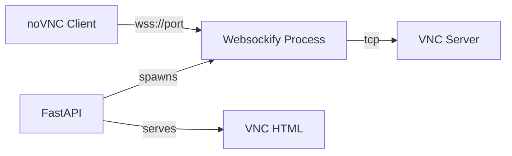
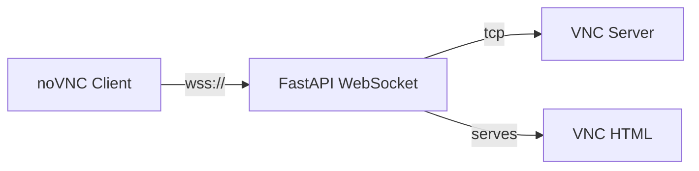

# VNC WebSocket Migration Plan: From Websockify to FastAPI

## Executive Summary
Migrate VNC proxying from the external websockify library to FastAPI's native WebSocket support to solve SSL certificate issues and simplify the architecture.

## Problem Statement
- Current implementation spawns separate websockify processes on different ports
- Each websockify process uses its own self-signed certificate  
- Users must approve multiple certificates (FastAPI + websockify)
- Certificate mismatch causes connection failures
- Process management overhead with multiprocessing

## Current Architecture



### Current Flow:
1. User requests `/site/vnc/{source_name}`
2. FastAPI spawns a websockify process on port 5900+
3. Returns HTML with the websockify port
4. noVNC connects to websockify on that port  
5. Websockify proxies to VNC server

## Proposed Architecture



### Proposed Flow:
1. User requests `/site/vnc/{source_name}`
2. FastAPI returns HTML with WebSocket endpoint
3. noVNC connects to `/ws/vnc/{source_name}`
4. FastAPI WebSocket handler proxies to VNC server
5. Single SSL certificate for all connections

## Technical Implementation Details

### 1. FastAPI WebSocket Handler Structure

```python
from fastapi import WebSocket, WebSocketDisconnect
import asyncio
import socket

class VNCWebSocketProxy:
    def __init__(self, source_name: str, vnc_host: str, vnc_port: int):
        self.source_name = source_name
        self.vnc_host = vnc_host
        self.vnc_port = vnc_port
        self.vnc_socket = None
        
    async def proxy_vnc_to_websocket(self, websocket: WebSocket):
        """Forward data from VNC server to WebSocket client"""
        
    async def proxy_websocket_to_vnc(self, websocket: WebSocket):
        """Forward data from WebSocket client to VNC server"""
        
    async def handle_connection(self, websocket: WebSocket):
        """Main connection handler"""
```

### 2. WebSocket Endpoint

```python
@app.websocket("/ws/vnc/{source_name}")
async def vnc_websocket(websocket: WebSocket, source_name: str):
    # Get VNC configuration
    # Create proxy instance
    # Handle bidirectional communication
```

### 3. Key Technical Considerations

#### Binary Data Handling
- VNC uses binary protocol (RFB - Remote Framebuffer)
- WebSocket must handle binary frames
- No text encoding/decoding

#### Connection Management
- Proper cleanup on disconnect
- Handle both client and server disconnections
- Connection pooling for efficiency

#### Performance
- Async I/O for non-blocking operations
- Buffer management for smooth streaming
- Consider using asyncio.create_task for concurrent operations

#### Security
- Single SSL certificate through FastAPI
- Authentication/authorization before establishing proxy
- Rate limiting and connection limits

### 4. noVNC Client Configuration Changes

Current connection (in vnc.html.jinja):
```javascript
// Connects to websockify port
url = 'wss://' + window.location.hostname + ':{{ port }}/websockify';
```

New connection:
```javascript
// Connects to FastAPI WebSocket endpoint
url = 'wss://' + window.location.host + '/ws/vnc/{{ source_name }}';
```

## Implementation Steps

### Phase 1: Create WebSocket Infrastructure
1. Create VNCWebSocketProxy class
2. Implement TCP socket connection to VNC server
3. Add WebSocket endpoint to FastAPI
4. Basic bidirectional data forwarding

### Phase 2: Protocol Handling
1. Handle RFB handshake
2. Implement proper binary frame handling
3. Add connection state management
4. Error handling and reconnection logic

### Phase 3: Integration
1. Update vnc() endpoint to return new HTML
2. Modify vnc.html.jinja template
3. Update noVNC connection parameters
4. Remove websockify process spawning

### Phase 4: Cleanup & Optimization
1. Remove websockify imports and dependencies
2. Clean up process management code
3. Add connection pooling
4. Performance optimization

## Benefits of Migration

1. **Single Certificate**: Only FastAPI's certificate needs approval
2. **Simplified Architecture**: No external process management
3. **Better Resource Management**: Connections managed by FastAPI
4. **Improved Debugging**: All logs in one place
5. **Reduced Dependencies**: Remove websockify requirement
6. **Better Integration**: Native FastAPI feature

## Risk Mitigation

1. **Compatibility**: Test with different VNC server implementations
2. **Performance**: Benchmark against websockify
3. **Fallback**: Keep websockify code temporarily for rollback
4. **Testing**: Extensive testing with various clients and scenarios

## Code Example - Basic WebSocket Proxy

```python
from fastapi import WebSocket, WebSocketDisconnect
import asyncio
import socket

class VNCWebSocketProxy:
    def __init__(self, vnc_host: str, vnc_port: int):
        self.vnc_host = vnc_host
        self.vnc_port = vnc_port
        self.vnc_socket = None
        
    async def connect_to_vnc(self):
        """Establish TCP connection to VNC server"""
        self.vnc_socket = socket.socket(socket.AF_INET, socket.SOCK_STREAM)
        self.vnc_socket.setblocking(False)
        loop = asyncio.get_event_loop()
        await loop.sock_connect(self.vnc_socket, (self.vnc_host, self.vnc_port))
        
    async def proxy_vnc_to_websocket(self, websocket: WebSocket):
        """Forward VNC server data to WebSocket client"""
        loop = asyncio.get_event_loop()
        try:
            while True:
                data = await loop.sock_recv(self.vnc_socket, 4096)
                if not data:
                    break
                await websocket.send_bytes(data)
        except Exception as e:
            logger.error(f"Error proxying VNC to WebSocket: {e}")
            
    async def proxy_websocket_to_vnc(self, websocket: WebSocket):
        """Forward WebSocket client data to VNC server"""
        loop = asyncio.get_event_loop()
        try:
            while True:
                data = await websocket.receive_bytes()
                await loop.sock_sendall(self.vnc_socket, data)
        except WebSocketDisconnect:
            logger.info("WebSocket disconnected")
        except Exception as e:
            logger.error(f"Error proxying WebSocket to VNC: {e}")
            
    async def handle_connection(self, websocket: WebSocket):
        """Main connection handler"""
        await websocket.accept()
        await self.connect_to_vnc()
        
        # Create tasks for bidirectional proxying
        vnc_to_ws = asyncio.create_task(self.proxy_vnc_to_websocket(websocket))
        ws_to_vnc = asyncio.create_task(self.proxy_websocket_to_vnc(websocket))
        
        # Wait for either task to complete
        done, pending = await asyncio.wait(
            [vnc_to_ws, ws_to_vnc],
            return_when=asyncio.FIRST_COMPLETED
        )
        
        # Cancel pending tasks
        for task in pending:
            task.cancel()
            
        # Cleanup
        if self.vnc_socket:
            self.vnc_socket.close()

# FastAPI endpoint
@app.websocket("/ws/vnc/{source_name}")
async def vnc_websocket(websocket: WebSocket, source_name: str):
    source = screamrouter_configuration.get_source_by_name(source_name)
    proxy = VNCWebSocketProxy(str(source.vnc_ip), source.vnc_port)
    await proxy.handle_connection(websocket)
```

## Testing Strategy

1. **Unit Tests**: Test proxy class methods
2. **Integration Tests**: Test full connection flow
3. **Load Tests**: Multiple concurrent connections
4. **Compatibility Tests**: Different VNC servers and clients
5. **Security Tests**: Certificate validation, authentication

## Success Criteria

- ✅ Single SSL certificate approval
- ✅ VNC connections work reliably
- ✅ Performance comparable to websockify
- ✅ Proper cleanup on disconnection
- ✅ No process management overhead
- ✅ Better error handling and logging