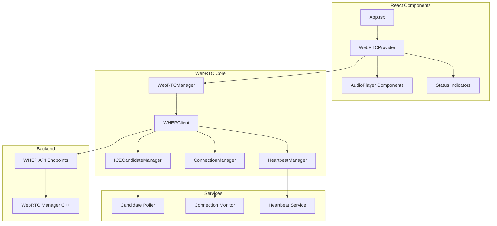

# WebRTC Implementation Refactor - Technical Specification

## Executive Summary

The current WebRTC implementation in ScreamRouter has critical architectural issues that prevent reliable audio streaming. The most severe issue is the complete absence of server ICE candidate polling in the client, which breaks proper WebRTC connection establishment. This document outlines a comprehensive refactor plan to fix these issues and create a robust, maintainable WebRTC streaming solution.

## Current State Analysis

### Critical Issues Identified

#### 1. **🔴 CRITICAL: Missing Server ICE Candidate Polling**
- **Location**: `screamrouter-react/src/lib/webrtc/WebRTCManager.ts`
- **Problem**: Client sends its ICE candidates to server but NEVER polls for server candidates
- **Impact**: Connections may fail or have suboptimal routing
- **Server Endpoint**: `/api/whep/{sink_id}/{listener_id}/candidates` (exists but unused)

#### 2. **Architecture Violations**
- WebRTC logic scattered across multiple components:
  - `AppContext.tsx` (lines 594-774): Contains WebRTC connection management
  - `WebRTCContext.tsx`: Partial WebRTC state management
  - `WebRTCManager.ts`: Connection logic without candidate polling
- Violation of Single Responsibility Principle
- Difficult to maintain and debug

#### 3. **Connection Management Issues**
- No automatic reconnection on failure
- Heartbeat exists but doesn't trigger recovery
- Multiple conflicting cleanup paths
- Race conditions between cleanup operations

#### 4. **Error Handling Deficiencies**
- Errors logged but not surfaced to users
- No retry logic for transient failures
- Silent failures during cleanup operations
- No user feedback for connection issues

#### 5. **Resource Management Problems**
- Potential memory leaks from unclosed peer connections
- Audio contexts not properly managed
- Media streams not always cleaned up
- Heartbeat intervals not cleared in all cases

## Proposed Architecture

### Component Hierarchy



### Class Responsibilities

#### 1. **WHEPClient** (New)
```typescript
interface WHEPClient {
  // Core WHEP protocol implementation
  createSession(sinkId: string, offer: RTCSessionDescriptionInit): Promise<WHEPSession>
  deleteSession(session: WHEPSession): Promise<void>
  
  // ICE candidate management
  sendCandidate(session: WHEPSession, candidate: RTCIceCandidate): Promise<void>
  pollServerCandidates(session: WHEPSession): Promise<RTCIceCandidate[]>
  
  // Session maintenance
  sendHeartbeat(session: WHEPSession): Promise<boolean>
}
```

#### 2. **ICECandidateManager** (New)
```typescript
interface ICECandidateManager {
  // Candidate queuing
  queueClientCandidate(candidate: RTCIceCandidate): void
  processQueuedCandidates(session: WHEPSession): Promise<void>
  
  // Server candidate polling
  startPolling(session: WHEPSession, pc: RTCPeerConnection): void
  stopPolling(): void
  
  // Configuration
  pollingInterval: number // Default: 1000ms
  maxPollingDuration: number // Default: 30000ms
}
```

#### 3. **ConnectionManager** (New)
```typescript
interface ConnectionManager {
  // Connection lifecycle
  connect(sinkId: string): Promise<MediaStream>
  disconnect(sinkId: string): Promise<void>
  
  // State management
  getConnectionState(sinkId: string): RTCPeerConnectionState
  isConnected(sinkId: string): boolean
  
  // Reconnection logic
  enableAutoReconnect: boolean
  reconnectDelay: number
  maxReconnectAttempts: number
}
```

#### 4. **HeartbeatManager** (New)
```typescript
interface HeartbeatManager {
  // Heartbeat lifecycle
  startHeartbeat(session: WHEPSession): void
  stopHeartbeat(session: WHEPSession): void
  
  // Configuration
  heartbeatInterval: number // Default: 5000ms
  missedHeartbeatThreshold: number // Default: 3
  
  // Callbacks
  onHeartbeatFailed: (session: WHEPSession) => void
}
```

#### 5. **Enhanced WebRTCManager**
```typescript
class WebRTCManager {
  private whepClient: WHEPClient
  private connectionManager: ConnectionManager
  private candidateManager: ICECandidateManager
  private heartbeatManager: HeartbeatManager
  
  // Single active connection enforcement
  private activeConnection: WHEPSession | null
  
  // Public API
  async toggleListening(sinkId: string): Promise<void>
  async stopAllConnections(): Promise<void>
  getConnectionStats(sinkId: string): WebRTCStats
  
  // Event handlers
  onConnectionStateChange: (sinkId: string, state: RTCPeerConnectionState) => void
  onStream: (sinkId: string, stream: MediaStream | null) => void
  onError: (sinkId: string, error: WebRTCError) => void
}
```

## Implementation Plan

### Phase 1: Critical Bug Fix (Immediate)
**Goal**: Fix ICE candidate polling to restore basic functionality

1. **Update WebRTCManager.ts**
   - Add server candidate polling mechanism
   - Implement polling interval (1 second)
   - Add candidates to peer connection as they arrive
   - Stop polling on connection or timeout

2. **Testing**
   - Verify candidates are fetched from server
   - Confirm they're added to peer connection
   - Test connection establishment success rate

### Phase 2: Core Refactor (1-2 days)
**Goal**: Separate concerns and create maintainable architecture

1. **Create WHEPClient class**
   - Implement WHEP protocol properly
   - Handle all HTTP communication with backend
   - Manage session lifecycle

2. **Create ICECandidateManager**
   - Handle client candidate queuing
   - Implement server candidate polling
   - Manage candidate timeouts

3. **Create ConnectionManager**
   - Manage RTCPeerConnection lifecycle
   - Handle connection state transitions
   - Implement reconnection logic

4. **Create HeartbeatManager**
   - Implement heartbeat scheduling
   - Handle heartbeat failures
   - Trigger reconnection when needed

### Phase 3: Integration (1 day)
**Goal**: Wire new components together

1. **Update WebRTCManager**
   - Integrate new component classes
   - Remove old connection logic
   - Add proper error handling

2. **Update WebRTCContext**
   - Use new WebRTCManager API
   - Remove duplicate state management
   - Simplify context interface

3. **Remove WebRTC from AppContext**
   - Delete all WebRTC-related code
   - Update components to use WebRTCContext
   - Clean up imports and dependencies

### Phase 4: Enhancement (1 day)
**Goal**: Add monitoring and user feedback

1. **Add Connection Statistics**
   - Track connection duration
   - Monitor packet loss
   - Calculate latency
   - Display connection quality

2. **Implement User Notifications**
   - Connection status indicators
   - Error toast notifications
   - Reconnection progress feedback
   - Quality warnings

3. **Add Debug Tools**
   - WebRTC stats overlay
   - Connection log viewer
   - ICE candidate inspector
   - Network diagnostics

## API Changes

### New Endpoints (None required)
The existing WHEP endpoints are sufficient:
- `POST /api/whep/{sink_id}` - Create session
- `PATCH /api/whep/{sink_id}/{listener_id}` - Send client ICE candidate
- `GET /api/whep/{sink_id}/{listener_id}/candidates` - Poll server candidates
- `POST /api/whep/{sink_id}/{listener_id}` - Heartbeat
- `DELETE /api/whep/{sink_id}/{listener_id}` - Close session

### Frontend API Changes

#### Before (Current)
```typescript
// In AppContext
onListenToSink(sinkId: string): void
```

#### After (Proposed)
```typescript
// In WebRTCContext
interface WebRTCAPI {
  // Connection control
  startListening(sinkId: string): Promise<void>
  stopListening(sinkId: string): Promise<void>
  stopAllListening(): Promise<void>
  
  // State queries
  isListening(sinkId: string): boolean
  getConnectionState(sinkId: string): RTCPeerConnectionState
  getStream(sinkId: string): MediaStream | null
  
  // Statistics
  getStats(sinkId: string): WebRTCStats | null
  
  // Configuration
  setIceServers(servers: RTCIceServer[]): void
  setReconnectPolicy(policy: ReconnectPolicy): void
}
```

## Error Handling Strategy

### Error Types
```typescript
enum WebRTCErrorType {
  // Network errors
  NETWORK_UNREACHABLE = 'NETWORK_UNREACHABLE',
  ICE_GATHERING_FAILED = 'ICE_GATHERING_FAILED',
  ICE_CONNECTION_FAILED = 'ICE_CONNECTION_FAILED',
  
  // Protocol errors
  WHEP_NEGOTIATION_FAILED = 'WHEP_NEGOTIATION_FAILED',
  INVALID_SDP_OFFER = 'INVALID_SDP_OFFER',
  INVALID_SDP_ANSWER = 'INVALID_SDP_ANSWER',
  
  // Server errors
  SINK_NOT_FOUND = 'SINK_NOT_FOUND',
  SERVER_UNAVAILABLE = 'SERVER_UNAVAILABLE',
  HEARTBEAT_TIMEOUT = 'HEARTBEAT_TIMEOUT',
  
  // Client errors
  BROWSER_NOT_SUPPORTED = 'BROWSER_NOT_SUPPORTED',
  MICROPHONE_PERMISSION_DENIED = 'MICROPHONE_PERMISSION_DENIED',
  AUTOPLAY_BLOCKED = 'AUTOPLAY_BLOCKED'
}

interface WebRTCError {
  type: WebRTCErrorType
  message: string
  details?: any
  recoverable: boolean
  suggestedAction?: string
}
```

### Error Recovery Matrix

| Error Type | Recovery Strategy | User Action Required |
|------------|------------------|---------------------|
| NETWORK_UNREACHABLE | Retry with exponential backoff | No |
| ICE_GATHERING_FAILED | Retry with new STUN/TURN | No |
| ICE_CONNECTION_FAILED | Full reconnection | No |
| WHEP_NEGOTIATION_FAILED | Retry once, then alert | Possible |
| HEARTBEAT_TIMEOUT | Immediate reconnection | No |
| SINK_NOT_FOUND | Alert user | Yes |
| AUTOPLAY_BLOCKED | Show play button | Yes |

## Testing Strategy

### Unit Tests
- ICECandidateManager polling logic
- HeartbeatManager timing
- ConnectionManager state transitions
- Error recovery mechanisms

### Integration Tests
- Full WHEP session lifecycle
- Multiple simultaneous connection attempts
- Network interruption recovery
- Server restart handling

### End-to-End Tests
- Audio streaming quality
- Latency measurements
- Connection reliability under load
- Browser compatibility

### Manual Test Scenarios
1. Start listening to sink
2. Verify audio playback
3. Disconnect network briefly
4. Verify automatic reconnection
5. Stop listening
6. Start listening to different sink
7. Verify first connection closes
8. Test with multiple browser tabs

## Performance Considerations

### Optimization Targets
- Connection establishment: < 2 seconds
- Reconnection time: < 3 seconds
- Audio latency: < 100ms
- Memory usage: < 50MB per connection
- CPU usage: < 5% during streaming

### Resource Management
- Limit ICE candidate polling duration
- Clean up closed connections immediately
- Reuse AudioContext instances
- Implement connection pooling for rapid switching

## Migration Path

### Step 1: Deploy with Feature Flag
```typescript
const USE_NEW_WEBRTC = process.env.REACT_APP_NEW_WEBRTC === 'true'

if (USE_NEW_WEBRTC) {
  // Use new implementation
} else {
  // Use existing implementation
}
```

### Step 2: Gradual Rollout
1. Internal testing (1 week)
2. Beta users (1 week)
3. 50% rollout (3 days)
4. 100% rollout
5. Remove old code (1 week later)

### Step 3: Cleanup
- Remove old WebRTC code from AppContext
- Delete deprecated components
- Update documentation
- Archive old implementation

## Success Metrics

### Technical Metrics
- Connection success rate > 99%
- Average connection time < 2s
- Reconnection success rate > 95%
- Zero memory leaks
- < 0.1% audio dropouts

### User Experience Metrics
- User-reported issues decrease by 80%
- Support tickets related to WebRTC decrease by 70%
- User satisfaction score increases
- Audio quality ratings improve

## Risk Assessment

### High Risk Items
1. **Breaking existing connections** - Mitigated by feature flag
2. **Performance regression** - Mitigated by load testing
3. **Browser compatibility** - Mitigated by extensive testing

### Medium Risk Items
1. **Increased complexity** - Mitigated by documentation
2. **Learning curve** - Mitigated by training
3. **Deployment issues** - Mitigated by gradual rollout

## Timeline

| Phase | Duration | Deliverables |
|-------|----------|--------------|
| Phase 1: Critical Fix | 4 hours | Working ICE candidate polling |
| Phase 2: Core Refactor | 1-2 days | New component classes |
| Phase 3: Integration | 1 day | Integrated system |
| Phase 4: Enhancement | 1 day | Monitoring & UI |
| Testing | 2 days | Test coverage > 80% |
| Documentation | 1 day | Developer & user docs |
| **Total** | **~1 week** | Production-ready WebRTC |

## Conclusion

This refactor addresses all critical issues in the current WebRTC implementation while providing a solid foundation for future enhancements. The phased approach ensures we can quickly fix the most critical bug (ICE candidate polling) while systematically improving the overall architecture.

The new architecture follows SOLID principles, provides better error handling, and creates a maintainable codebase that will be easier to debug and extend. Most importantly, it will provide users with a reliable, high-quality audio streaming experience.